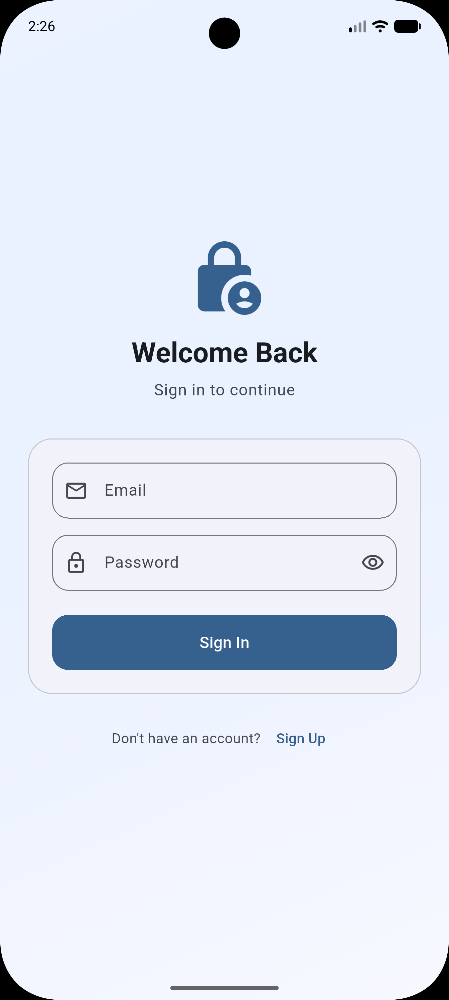
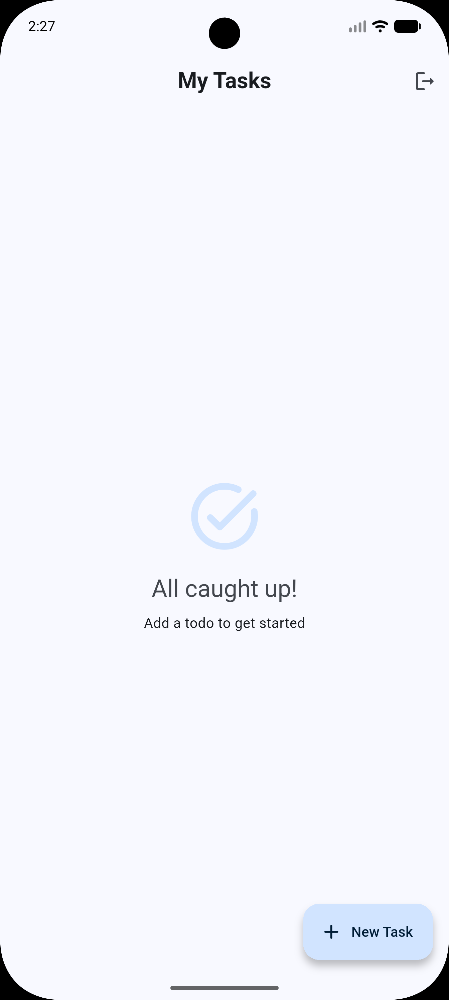
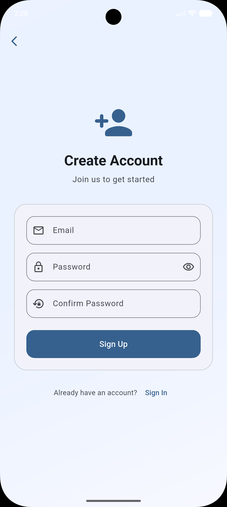
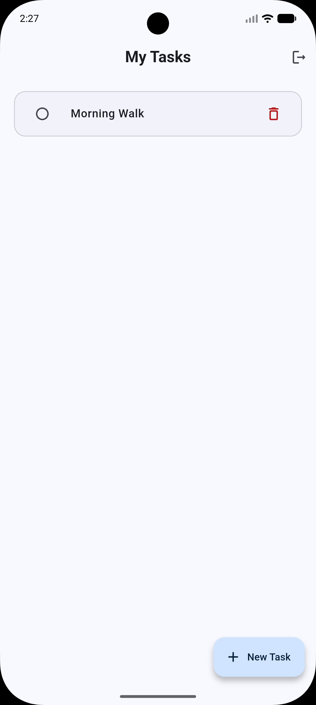
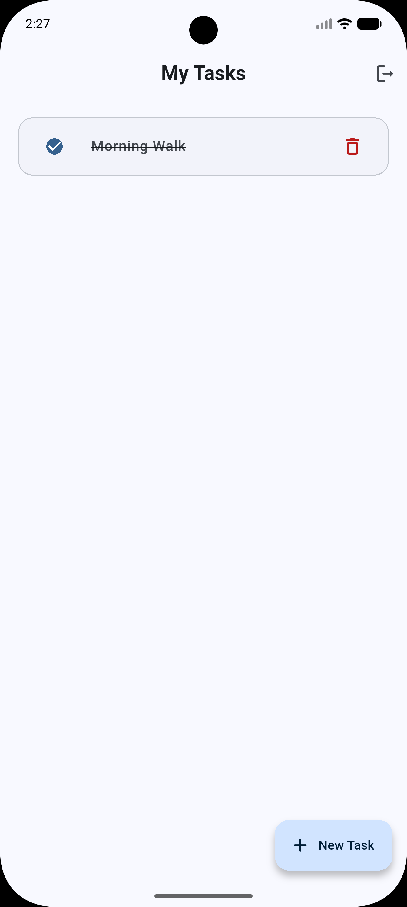

# Supabase Easy 🚀

Reduce Supabase + Flutter boilerplate by 60–70% while keeping type safety, flexibility, and performance.

## Features

- **Simplified Initialization**: Initialize Supabase with a single call.
- **EasyAuth**: Simplified authentication API for common tasks.
- **EasyRepository**: Generic repository for type-safe CRUD operations.
- **Simplified Real-time**: Easy-to-use streams for real-time updates.

---

**Note**: This plugin is designed to be highly useful for rapid development. We are committed to continuously optimizing the codebase and keeping it updated with the latest Supabase and Flutter features.

## Screenshots

| Login & Signup | Task Management |
| :---: | :---: |
|  |  |
|  |  |
| |  |

## Getting Started

Add `supabase_easy` to your `pubspec.yaml`:

```yaml
dependencies:
  supabase_easy: ^0.0.2
```

## Setup Supabase

To use this plugin, you need to:

1. Create a Supabase project at [supabase.com](https://supabase.com).
2. Create your tables (e.g., `todos`).
3. Enable **Row Level Security (RLS)** on your tables.
4. Add policies to allow authenticated or public access. For testing, you can use:
   ```sql
   CREATE POLICY "Allow public access" ON todos FOR ALL TO public USING (true) WITH CHECK (true);
   ```
5. Get your **Project URL** and **Anon Key** from the Supabase Dashboard (Settings > API).

## Usage

### 1. Initialize

```dart
await SupabaseEasy.initialize(
  url: 'https://your-project.supabase.co',
  anonKey: 'your-anon-key',
);
```

### 2. Define your Model

```dart
class Todo extends EasyModel {
  @override
  final String id;
  final String title;

  Todo({required this.id, required this.title});

  @override
  Map<String, dynamic> toJson() => {'id': id, 'title': title};

  factory Todo.fromJson(Map<String, dynamic> json) => Todo(
    id: json['id'],
    title: json['title'],
  );
}
```

### 3. Use Repository

```dart
final todoRepo = EasyRepository<Todo>(
  tableName: 'todos',
  fromJson: Todo.fromJson,
);

// Get all
final todos = await todoRepo.getAll();

// Create
await todoRepo.create(Todo(id: '1', title: 'Buy milk'));

// Real-time stream
todoRepo.stream(primaryKey: ['id']).listen((todos) {
  print(todos);
});
```

### 4. Simplified Auth

```dart
await EasyAuth.signIn(email: '...', password: '...');
print(EasyAuth.currentUser?.email);
```

## Example

Check out the [example](example/) folder for a complete Todo app implementation using this plugin.

## License

This project is licensed under the MIT License - see the [LICENSE](LICENSE) file for details.


